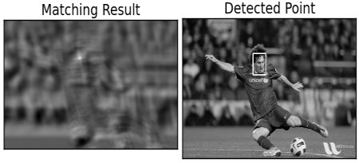

Setando o environment Python

# **Instalação**

### **Windows**

1. Baixar e instalar executável da [linguagem python (recomendado 3.6.5~)](https://www.python.org/downloads/)
2. Baixar e instalar o [PIP](https://pip.pypa.io/en/stable/installing/) (baixar o arquivo get-pip.py e executá-lo no terminal com o comando )

    `python get-pip.py`

3. Ainda no terminal, execute os comandos  e

    `pip install opencv-python`

    `pip install numpy`

### **Ubuntu (deve funcionar em outros linux baseados no Debian)**

1. Como o Ubuntu já vem por padrão com o python 2.7 instalado, podemos pular o primeiro passo e instalar diretamente o PIP com o comando

    `sudo apt-get update install python-pip`

2. Ainda no terminal, execute os comandos (esta etapa pode demorar um pouco)

    `pip install opencv-python -vvv`

    `pip install numpy -vvv`

### **Objetivos**

### Teoria

*Template Matching* é um método para buscar e encontrar a localização de uma **imagem de template** numa **imagem maior**. O `OpenCV` vem com uma função chamada `cv.matchTemplate()` que serve justamente para isso.

Em resumo ele coloca uma imagem sobre a outra e compara as duas para cada posição disponível na **imagem maior.** O `OpenCV` implementa vários métodos diferentes para comparação. Ao fim, os métodos retornam uma imagem em preto e branco, em que cada pixel representa quanto aquela vizinhança tem de semelhança com a **imagem de template.**

- Digamos que a **imagem maior** tem as dimensões (WxH)
- Digamos que a **imagem de template** tem as dimensões (wxh)
- Nesse caso a **imagem de saída** terá as dimensões (W - w +1, H - h +1)

Depois de obtido o resultado, você pode usar o **[cv.minMaxLoc()](https://docs.opencv.org/master/d2/de8/group__core__array.html#gab473bf2eb6d14ff97e89b355dac20707)** para determinar onde está o valor de máximo e mínimo.

- Pegue um retângulo de tamanho (w,h), que é o tamanho da nossa **imagem de template**, e desenhe sobre a região de máximo
- Este retângulo corresponde ao nosso "match", onde encontramos o resultado

**Nota:** Quando usando o método de comparação `cv.TM_SQDIFF` , o valor de mínimo dá resultados melhores.

## Algoritmo exemplo
- Vamos tentar encontrar o rosto do Messi em uma foto dele
- Para isso usaremos o OpenCV e bibliotecas para apresentar o resultado final
- Ao final, veremos a **imagem de saída** lado a lado da **imagem maior** com um retangulo identificando onde foi encontrada a **imagem de template**

### Como executar o algoritmo de Template Matching
(lembre-se de preparar o ambiente como no começo deste arquivo)
1. Abra no seu terminal a pasta onde está o arquivo python (template_matching.py)
2. Execute o comando `python template_matching.py`

Você deve ver como resultado algo como a seguir

Ao fechar a janela, o algoritmo irá abrindo os próximos

## Exercício:
Detectar todas as moedas em uma tela do Jogo "super mario". Todas as imagens necessário estão na pasta './imagens'

